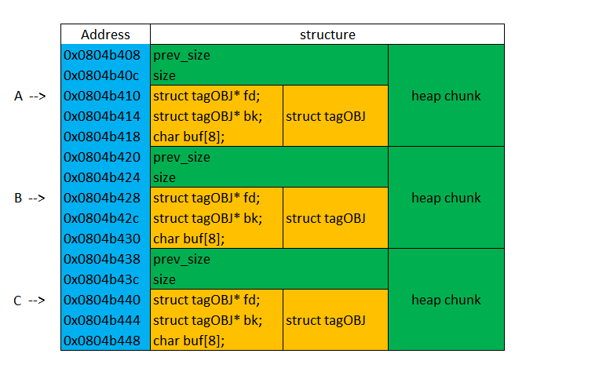

# pwnable.kr -- Toddler's Bottle -- unlink

## 1. Challenge
  > Daddy! how can I exploit unlink corruption?  
  >   
  > ssh unlink@pwnable.kr -p2222 (pw: guest)  

## 2. Solution
  * Connect target via ssh and see source code:
    ```c
    #include <stdio.h>
    #include <stdlib.h>
    #include <string.h>
    typedef struct tagOBJ{
        struct tagOBJ* fd;
        struct tagOBJ* bk;
        char buf[8];
    } OBJ;

    void shell(){
        system("/bin/sh");
    }

    void unlink(OBJ* P){
        OBJ* BK;
        OBJ* FD;
        BK=P->bk;
        FD=P->fd;
        FD->bk=BK;
        BK->fd=FD;
    }
    int main(int argc, char* argv[]){
        malloc(1024);
        OBJ* A = (OBJ*)malloc(sizeof(OBJ));
        OBJ* B = (OBJ*)malloc(sizeof(OBJ));
        OBJ* C = (OBJ*)malloc(sizeof(OBJ));

        // double linked list: A <-> B <-> C
        A->fd = B;
        B->bk = A;
        B->fd = C;
        C->bk = B;

        printf("here is stack address leak: %p\n", &A);
        printf("here is heap address leak: %p\n", A);
        printf("now that you have leaks, get shell!\n");
        // heap overflow!
        gets(A->buf);

        // exploit this unlink!
        unlink(B);
        return 0;
    }

    ```

  * We can see the program call `gets()` function at `main()`. So we can overflow it.

  * In gdb, we can see the value of A, B, C:

    

  * We can see that object A is allocated first, then C is allocated and last it is B. So in heap memory, the layout would be:

    

  * If we change object B's `fd` and `bk`, then in the function `unlink()`, data at a pair of wrong addresses would be changed,

  * We also notice that at the end of function `main()`, there is:
    ```asm
    mov     ecx, [ebp - 0x4]
    leave
    lea     esp, [ecx - 0x4]
    ret
    ```

  * So if we change the data at `ebp - 0x4` which is equivalent to `&A + 0x10`, we can make `esp` point to heap area. Then after `ret`, we can hijack `eip`.
